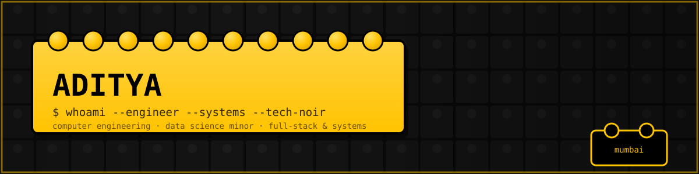
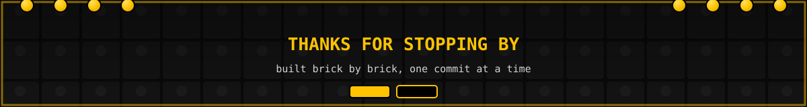

<div align="center">



<br/><br/>


</div>

<div align="center">

</div>

<div align="center">


</div>

<div align="center">

</div>

## About

I'm **Aditya** — final-year **Computer Engineering** student (Data Science minor) at Ramrao Adik Institute of Technology, Mumbai. I build CLI-first APIs, stateless real-time systems, and interfaces with zero wasted pixels. My aesthetic is **tech-noir**: AMOLED black, zinc greys, monospace type, sharp geometry — pulled from Apple's restraint, Palantir's density, and F1's obsession with shaving milliseconds off everything.

- **Building** curl-friendly, stateless, terminal-first developer tooling
- **Shipping** AI-native products — from supply chain copilots to stock market cockpits
- **Developing** native Android with Kotlin + Jetpack Compose for deep system control
- **Running** Arch Linux + Hyprland as a daily driver

<div align="center">

[](https://adityalabs.in)
[](https://api.adityalabs.in)
[](https://github.com/adityasync)

</div>

<div align="center">

</div>

<div align="center">

## Tech Stack

</div>

### Languages

<p>
  
  
  
  
  
</p>

### Frontend

<p>
  
  
  
</p>

### Backend & APIs

<p>
  
  
  
</p>

### Mobile

<p>
  
  
</p>

### Databases

<p>
  
  
</p>

### Tools & Environment

<p>
  
  
  
  
</p>

### AI / Machine Learning

<p>
  
  
  
  
  
  
</p>

<p>
  
  
  <!--  -->
  
  
  
</p>
<div align="center">

</div>

<div align="center">

## GitHub Statistics


</div>

<div align="center">

</div>

## Featured Projects

<table>
<tr>
<td width="50%" valign="top">

### Personal API — `api.adityalabs.in`
Curl-friendly, stateless, CLI-first personal API on Next.js App Router. HMAC-signed minigames, chunked ASCII boot animations, and content negotiation between plain text and JSON — built for people who live in the terminal.

### ZENIT
An AI-native Indian stock market cockpit with Palantir-inspired density and a fully stateless SSE architecture.

### ChainPilotAI
Full-stack supply chain AI copilot — FastAPI, PostgreSQL, a scikit-learn ML pipeline, and GPT-4o streamed live over SSE. Built for the OpenAI × Outskill AI Builders Hackathon.

### OncoVision-X
Lung nodule detection using DCA-Net with Monte Carlo Dropout on the LUNA16 dataset — my flagship B.Tech final-year project.

</td>
<td width="50%" valign="top">

### Vinyl
Ad-free Spotify WebView wrapper, rebuilt natively in Jetpack Compose + Kotlin for deep WebView and MediaSession control.

### expenseMania
GenZ-styled expense tracker — Next.js + Neon Postgres — with a Spotify-Wrapped-style breakdown and an AI-generated spending roast feature.

### sinGes
IEEE-format research paper on Indian Sign Language recognition using a hybrid 3D CNN-LSTM architecture.

### Isometric Portfolio
Lofi isometric Three.js interactive room as my portfolio root — clickable objects route to each subdomain project.

</td>
</tr>
</table>

<div align="center">

</div>

## Fun Facts

```javascript
const aditya = {
    role: "Software Engineer | AI & Data Science",
    stack: ["React", "Next.js", "TypeScript", "FastAPI", "Spring Boot", "Kotlin"],
    environment: "Arch Linux + Hyprland",
    aesthetic: "AMOLED black, zinc greys, monospace — tech-noir",
    influences: ["Apple", "Palantir", "Formula 1"],
    currentlyBuilding: "api.adityalabs.in — a CLI-first personal API",
    askMeAbout: ["Stateless SSE architectures", "Terminal-first UX", "AI/ML pipelines"],
    motto: "Ship the system, not the slide deck."
};
```

<div align="center">

</div>

<div align="center">

## Developer Wisdom


</div>

<div align="center">

</div>

<div align="center">



<br/><br/>


</div>
